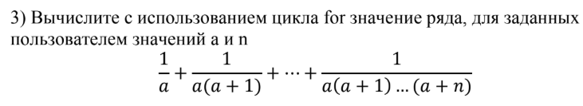
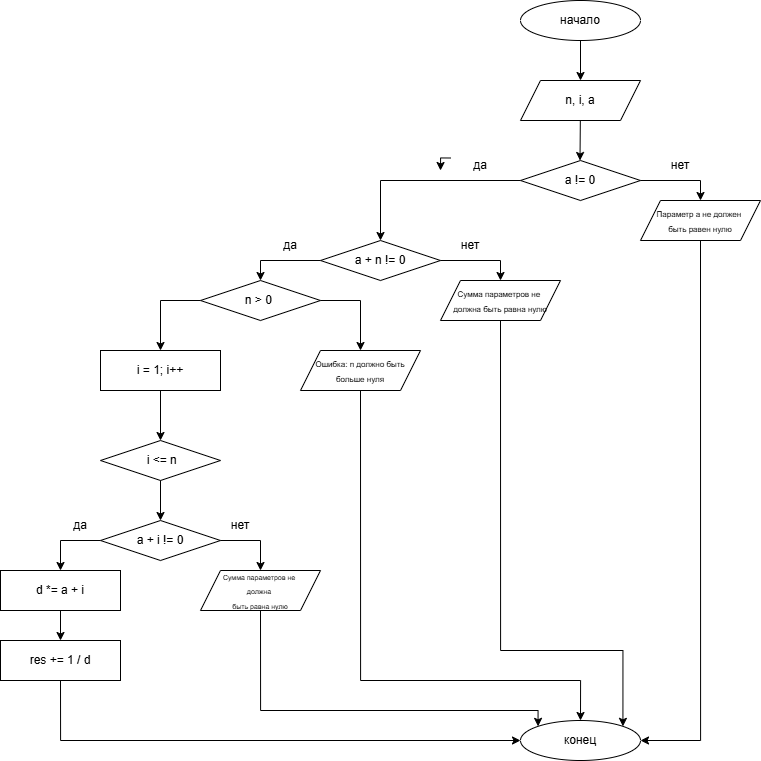

# Домашнее задание к работе 8 
## Условие задачи 

## 1. Алгоритм и блок-схема 
### Алгоритм 
1. Начало
2. Инициализировать переменные:
   + `n` - переменная в формуле
   + `i` - счётчик цикла
   + `a` - переменная в формуле
3. Считать введённые значения для `a` и `n`
4. Проверка условия: продолжить, если `a` не равно 0, иначе вывести: "Параметр а не должен быть равен нулю"
5. Проверка условия: продолжить, если `a` + `n` не равно 0, иначе вывести: "Cумма параметров не должна быть равна нулю"
6. Проверка условия: продолжить, если `n` > 0, иначе вывести: "Ошибка: n должно быть больше нуля"
7. Инициализировать переменные:
   + `d` = `a` - для вычисления знаменателя внутри цикла
   + `res` = 1 / `a` - переменная, в которую записывается результат вычислений каждую итерацию цикла
8. Инициализировать цикла: i = 1; i <= n; i++
9. Тело цикла:
    + Проверка условия: продолжить, если `a` + `i` не равно нулю, иначе вывести "Cумма параметров не должна быть равна нулю"
    + `d` *= `a` + `i` - домножить текущее значение знаменателя на `a` + `i`
    + `res` += 1. / `d` - прибавить к текущему результату дробь
10. Вывести результат
11. Конец
### Блок-схема
  
[Ссылка на draw.io](https://viewer.diagrams.net/?tags=%7B%7D&lightbox=1&highlight=0000ff&edit=_blank&layers=1&nav=1&title=blockschemelab8.png&dark=auto#R%3Cmxfile%3E%3Cdiagram%20name%3D%22%D0%A1%D1%82%D1%80%D0%B0%D0%BD%D0%B8%D1%86%D0%B0%20%E2%80%94%201%22%20id%3D%22AKs2iY19y15L0KLZd2qO%22%3E7VxJc6M4FP4tc%2FBlqpJCbMbHeMnMYWa6q3KYzpEYxaYbIwZwYvevHyEkFkkYbwgSd1WKaENIb9P3niSPjNlm90fsRuu%2FkQeDka55u5ExH%2Bk6MCcW%2FpeV7GmJZth5ySr2PVpWFjz5PyFrSEu3vgeTWsMUoSD1o3rhEoUhXKa1MjeO0Xu92SsK6l%2BN3BUUCp6WbiCW%2Fut76ZqWAntSVvwJ%2FdWafdq2zLxm47LWdCrJ2vXQe6XIWIyMWYxQmqc2uxkMMvIxwuTvPTbUFiOLYZge88Ic%2FXx4mv8MNf3LP96X78vN8zK%2Bm1B2vLnBlk6ZjjbdMxqsYrSNaDMYp3Ano7z7wppr4sBAMV0sKRBtYBrvcRPaUfEKFRKTZt9Lgo9tWrau0LoodCmTV0XXJRlwglLiBKoYIlHm2mj6QJ4L8pyTpzWag5FjCyTD38ASijPT97WfwqfIXWY171hLcNk63eDh4DeNaSNZq%2BQ7wLlGolocUce6SFWgS6hqdkXUsaZC1M6hFbBF2tiajDagK%2BLo%2FRFnrB0mjiYSx5IRx9A7I45cHXMV1IgKjlkaP6dUTXtQSv0wLXWJoKlVQrNdzGDoPWQrJ84tAzdJ%2FGWdOlgKQw9mH9EKWkFPWEbPpFRNykTCsLIYBm7qv9U%2FKqMW%2FcJX5OPhFIwwGpYc1kOCtvES0peqa2pLPw7XT%2BrGK5gK%2FRDWFZM%2Bn5vWsLiJP0zodqBhgyFWxHUwubdq%2FAK8zTqa8WJXPBrpmPfjofE%2Bn%2B8v3ivgvQjaw5E%2By97K%2F7mCKGDnI8qSmJtuEMAArWJ3g5kewdjHo4ExX%2Fe1rGhbLl%2F9HWSum5rlk7O2va2mjsAHTHntN5JkEKnChHiNNi%2FbZAgAhBfc3kg4ubYZw%2FSJ99%2ByDFZSmn2u1s13tdxelfkDZp%2F2T%2BA8D1WOtX6FYO%2B5fIvtwyx095VmUdYgaR4w0OUDLoUt7%2FGqhpX5d0NZVXtbLZ0rSYtpqpEW%2FjtKpGUMROHAjH6iWRSna7RCoRssylJOPMo2fyEUUQn6DtN0TxdUd5uiunzBnZ9%2BYyYMp4lxu9ctmi3NW5a5lnVrBfagIcZ3oSACXhDHx8nP1QwCEA1CFl0wabyB5z9esNM6u2RLfZLG6AecoQBluCtEISQwKgi4IjfwV2FmZzCTCBLLIIG%2FdIMHWrHxPU8iVZ3hBzDh2GGJ%2BEEWqjW6gg%2FgYGwoD8%2BKJvyTc8kYHJckAXXdDjIevCKi7iVz7P%2B2iFXcJcQIPuAGTrQjJGPVOLUi%2FzEpJ4%2BVSKBWiQTOalKQ1%2BqsAU0wSaFZsxLjzwOJNuuENNZtd5MJR%2FiSRPkwgnw4j%2FlM6Khosee%2F8UXXmPAUkMlMKxObkQlw89frQy8mjJsZbIY4vWiZBS6uTeQz%2BpY84tElYW%2B1nhEQY7WZdznSMRG0cNh%2BJudsyLb0FBNzYKHSvoA9zxg%2BcNWK69mLR0a6j8bx3IC69fKO2PS%2BBWHgwfXp0sBiAryXd23paPqOEmmRRNpv0QVgNDdEW64WTIpR11%2BQX1Dl3rkkC%2BzmcDKJ3PASBDyrANhZ5VlA%2BlPcgRLt64JH0Aj18xm0Qv1LJ3rQIZnX53ySR8C9e9gjkE32FjwCQaV6325iMKW%2B76cVgkqZoWmi6A7OQ7jjkWj%2F1JWsK7eICjnGGHzE%2FlhQCLiNIsPiOrrWRhH%2FHU0BKNQHc5Cq6fieGmExLxWWroRDpTDY3WEdEt5ckDXZIeuzw1b74jyylvcQjloimHN2LPIwYCh6X1TwwKwygiJUKsKGx0bY8CEBQtvJWF74JWF2xUesxTi7n3ErS2k5LbIjQlPyx0OCmjXqDBa00JSHBQOg6a1besaJyZmm3eRZ0%2FXBSFmot46H%2FSpqzg0WUZFQ1IrugXLb5QQO3pi9x9LHgwmfNpFOUfiUs1XmuYdk%2BI6KuzuqNEZ%2BjjHfacp0pc%2BdphPVo6Bdf4dCJUdGblI9eM6ce8mC144jjwCd6kfynzEVeA4sUH0rewttlxY5FgBRl5UGsR3ZuZUbVGX%2Bhu7ZqqxKl%2FtRZomn8Pk3plpUurjJPxSdnohWVeWh3Xt2Tve5UiM%2Fs1veZBgpuMfAfgmg9aSvQ%2F2r1gsPhlwwTrNFl2r%2BGNQ0X2hvGc6h9h1ZCqmLetLxwPFgN0evfA6yaaLHbY4OYpTd7c0ec1rzE%2B3Ytq01vMcxFtcaxb6gGCrxcPZ3ktRqTnY%2F4dgmig6HgoO559wvBOeWNZv%2FJZIznWlbcXDWmXxw9FVeKu0NfzmK8NdleivGFGOYUINHrB8gmUf89AZq%2FezeQ%2B2Tfm8YnqUuaq5dH60ubHN%2BmO6Kwdtjp8VdcQ6278ZdmUiW3IFLIRiUDIJBy6DFwWbbOiyDNoNg8vYdyaDxwWWwf%2BDAbmH2BRxwtvy1y1wuyl8NNRb%2FAw%3D%3D%3C%2Fdiagram%3E%3C%2Fmxfile%3E)
## 2. Реализация программы 
```C
#define _CRT_SECURE_NO_DEPRECATE
#include <stdio.h>
#include <locale.h>
#include <math.h>

int main()
{
    setlocale(LC_CTYPE, "RUS");
    int n, i;
    double a;
    puts("Введите число a:");
    scanf("%lf", &a);
    puts("Введите число n:");
    scanf("%d", &n);
    if (a == 0) puts("Параметр а не должен быть равен нулю");
    else
        {
        if (a + n == 0) puts("Cумма параметров не должна быть равна нулю");
        else
            {
            if (n < 0) puts("Ошибка: n должно быть больше нуля");
            else
                {
                double d = a;
                double res = 1. / a;
                for (i = 1; i <= n; i++)
                    {
                    if (a + i == 0) puts("Cумма параметров не должна быть равна нулю");
                    else
                        {
                        d *= a + i;
                        res += 1. / d;
                        }
                    }
                printf("Результат равен %lf", res);
                }
            }
        }
    return 0;
}
```
## 3. Результат работы программы
### Не выполняется одно из условий:
Введите число a:  
-5  
Введите число n:  
5  
Cумма параметров не должна быть равна нулю
### Переменная а - целое число:
Введите число a:  
5  
Введите число n:  
6  
Результат равен 0.238764
### Переменная a  - вещественное число:
Введите число a:  
2.4  
Введите число n:  
3  
Результат равен 0.572226
## 4. Информация о разработчике 
Вильальба Агния, группа бТИИ-251
