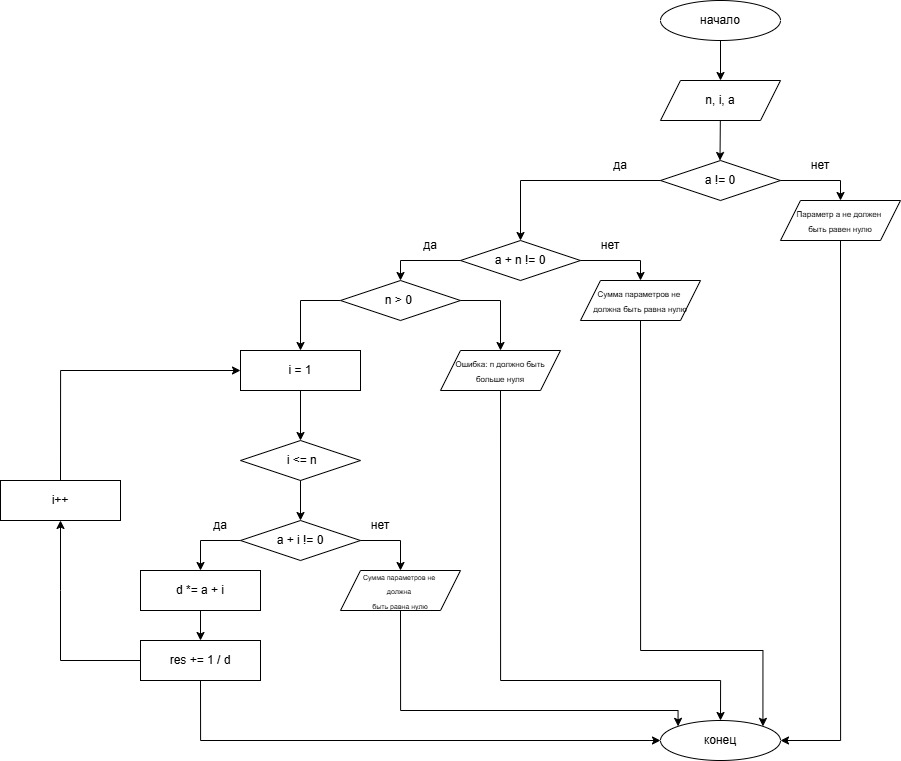

# Домашнее задание к работе 8 
## Условие задачи 

## 1. Алгоритм и блок-схема 
### Алгоритм 
1. Начало
2. Инициализировать переменные:
   + `n` - переменная в формуле
   + `i` - счётчик цикла
   + `a` - переменная в формуле
3. Считать введённые значения для `a` и `n`
4. Проверка условия: продолжить, если `a` не равно 0, иначе вывести: "Параметр а не должен быть равен нулю"
5. Проверка условия: продолжить, если `a` + `n` не равно 0, иначе вывести: "Cумма параметров не должна быть равна нулю"
6. Проверка условия: продолжить, если `n` > 0, иначе вывести: "Ошибка: n должно быть больше нуля"
7. Инициализировать переменные:
   + `d` = `a` - для вычисления знаменателя внутри цикла
   + `res` = 1 / `a` - переменная, в которую записывается результат вычислений каждую итерацию цикла
8. Инициализировать цикла: i = 1; i <= n; i++
9. Тело цикла:
    + Проверка условия: продолжить, если `a` + `i` не равно нулю, иначе вывести "Cумма параметров не должна быть равна нулю"
    + `d` *= `a` + `i` - домножить текущее значение знаменателя на `a` + `i`
    + `res` += 1. / `d` - прибавить к текущему результату дробь
10. Вывести результат
11. Конец
### Блок-схема
  
[Ссылка на draw.io](https://viewer.diagrams.net/?tags=%7B%7D&lightbox=1&highlight=0000ff&edit=_blank&layers=1&nav=1&title=blockschemelab8.png&dark=auto#R%3Cmxfile%3E%3Cdiagram%20name%3D%22%D0%A1%D1%82%D1%80%D0%B0%D0%BD%D0%B8%D1%86%D0%B0%20%E2%80%94%201%22%20id%3D%22AKs2iY19y15L0KLZd2qO%22%3E7RzJluMm8Fty8CXvzTyhzfKxvXRySDLzXh8yfaQt2tZEFo4kT9vz9QEEWgDLqxbHPrRaQImlNqqKwgNrstr%2BFsP18k%2Fso3BgGv52YE0HpgnskUP%2B0ZodrzEsN6tZxIHP64qKl%2BAnEoC8dhP4KKkAphiHabCuVs5xFKF5WqmDcYw%2FqmDvOKyOuoYLpFS8zGGo1v4d%2BOmS1wJ3VDT8joLFUgztOnbWsoICmi8lWUIff5SqrNnAmsQYp9nbajtBIUWfQEz23fOe1nxmMYrSYz6Y4p9PL9OfkWF%2B%2Bcv%2F8n2%2Bep3Hn4DB%2B%2FkBww1fM59uuhNIWMR4s%2BZgKE7RVod6%2BCbADXVmIF8vYRWEVyiNdwSEd%2BTxLziT2Lz4USB8ZPC6ZQnXQ5dXQk7kRd5zgQbywjFxAlYsFSdTYzB%2BYs8Ze07Z0xlMwcBzFYyRMQiHksL4Yxmk6GUN57Tlg0gJqVumKzId8qU1JshLYRChmJQNUt6L5TI26yi5F8muW8Xy0FTRDEwNmu2msDx0NKznwhVFUfSW0H%2FBgM6I14UpRRCFMyIF4%2FESr942SZ8wnmNO8LWGsVvGuHtY2FHkP1HFSUrzECZJMK%2Fij%2BiCyEd%2BBXvIV7Toubgr4cbRoEbUxSiEafCjOqoOX3yErzgg88lJYxkSaTwJ5QnexHPEvyor1QMdOabUUQrjBUqVjhj58mVfQFFPoShkMjOmX5K%2FXzKBMRQ634DAOJ2rKO%2BI3fEuBEYhjYzyYwXGlAVmeJzAEBTDXQlsTQGSmgnL49gV64i8ZD1eVRo9U2842OypyiCRoLTKLDpZTNIY%2F4MmOMRUBCMcUbviPQhDqQqGwSKiXEg4iUrrmMpoQGzZJ96wCnyfDi2xZHsCDkYSUYAq4K6Gia3G5Ftj6d2lfFvuleTbbkm%2BlXFakW9bL99lZ0BloHuTcsvpmZSPVM1LBfSFF3GcLvECRzCcFbUS9gqYPzBeczJ%2BR2m64zELuElxlchoG6Tf6OefHV56LbVMt7xnVtiJQkTW%2B61ceC0Xio9YaTe4is4hiGHCXcf43FXLhLcG0NJzxmna6VJdMARSJESCd4XVrIdvSHdovV3m075jNruCPd1%2FN1g0fEoYgz0RgOF6y6gtmsnbgv6fMMVjMSU0KT0N6gnQl2depGCGeM%2FBhN4qWrMQhyk%2BF%2BpNcs7F9Ak6shVksxHVfvBDrrp0oSVjKptiVuOWZmn0ZJaAoXNcQu2EoVOigFmdeo7vnJ5ZD7MDqyDVmoXItZIOTJZwTV%2BJnoBhiEK8iOGKAK5RHBBuZztFpe1r0XDIaXwPtkiEc9t1Ii3ZUxmqu0%2FLTqQadfFJ8Vf2alTcddlHr%2BxBvfHTQf9QPHzY8Vq31wVn2vFKRzLtGg5seaMbt9myHrq12ryWrLbLZFcNYcYo4VqRqUjACs%2Fk6d%2BqinQ7j%2F2PgIK73gtUIUP9cIPEqW8%2F3SBHVtlevRuUnwDq4Ztxg0aajbnnbAj6xYSg10zoyorPOcCErlkH3xATWjfOhD0wLoB1C8aFqYnY3qVjILvF%2BcH1pSfeebT3ygF%2BZRyjBcUgNnhNkC5Zw%2BiYqJBXExUazVg0x2ORHU%2FEifLMIiPrIRJxoPpI10yA7Qs15b3PSpGkSWkGzv6A03MphpSt%2FK6CSLYsLU7X5vtQPalkyVHCQboNt0hOI%2BgBXh8bxB59O7rSBmG3HDkyVYKWY%2BxUuw1LEfixUKYy0XucwtmZtDyEZaB1nc%2FNlpD7kdMQGxYV3ZFkl%2BQ8JgTTKdnB6LNTIVgufidTXu1KTmdvOnW0d8Q%2F6Eo%2BiH81R0chPjHxqdsQZP%2Bgwgv%2FT0NfvhXhdb3D6vO5bymLW0Yp6Nxq0Tn1F2m6zk4oDmpIYHepIhXSn3utwpV8CFOOVl0pyOSY%2Bgk3GmQSR%2FK92Xk721G9K7GLZ7fDLvI47bCL5g7K41JBSYalSwVAE1NqNd0Y1EYgHlniXPh7RzbdXZDTMkJrY%2F%2BnJOGaAkDOwK0%2FGHA4cGspsHULPi0FNp%2F6tVJg78J9kXfQfOPrzNYGaoiwyHCNbsyVsSV7VvfTBC2jt28hu65sR4U0cgDl3Atrx8ZgL72kIibcrO34uPDPu5EV5bnsIuc3NcUuyjitsIsmJvxwNWpk2FL3g3ZtVjVc%2BHA1VA9RFv7OydZcmlH3dwGr6UJ7XYxr5FMdvgtYnyF1%2BWU83WLv0hNRZKzzkxRh6lTPuIycczl1DEPl5f57JnI6Zw%2FQrdmK7tLUlD2TszNt5fscTWXaKuO0kWkLNBGAznLw87T7G7vgNzr2gt%2Bw0yT8kaoaAhYQ0qjanuWtyr8P190ZdmuH2OAAW%2BciVBagXJz0ItS8KBx91zVjxq42B%2BXq%2FLlZtspPaR2ZZXtyHKI6jFsNQxwCF8s7cyshxeL3cTPw4neGrdl%2F%3C%2Fdiagram%3E%3C%2Fmxfile%3E)
## 2. Реализация программы 
```C
#define _CRT_SECURE_NO_DEPRECATE
#include <stdio.h>
#include <locale.h>
#include <math.h>

int main()
{
    setlocale(LC_CTYPE, "RUS");
    int n, i;
    double a;
    puts("Введите число a:");
    scanf("%lf", &a);
    puts("Введите число n:");
    scanf("%d", &n);
    if (a == 0) puts("Параметр а не должен быть равен нулю");
    else
        {
        if (a + n == 0) puts("Cумма параметров не должна быть равна нулю");
        else
            {
            if (n < 0) puts("Ошибка: n должно быть больше нуля");
            else
                {
                double d = a;
                double res = 1. / a;
                for (i = 1; i <= n; i++)
                    {
                    if (a + i == 0) puts("Cумма параметров не должна быть равна нулю");
                    else
                        {
                        d *= a + i;
                        res += 1. / d;
                        }
                    }
                printf("Результат равен %lf", res);
                }
            }
        }
    return 0;
}
```
## 3. Результат работы программы
### Не выполняется одно из условий:
Введите число a:  
-5  
Введите число n:  
5  
Cумма параметров не должна быть равна нулю
### Переменная а - целое число:
Введите число a:  
5  
Введите число n:  
6  
Результат равен 0.238764
### Переменная a  - вещественное число:
Введите число a:  
2.4  
Введите число n:  
3  
Результат равен 0.572226
## 4. Информация о разработчике 
Вильальба Агния, группа бТИИ-251
